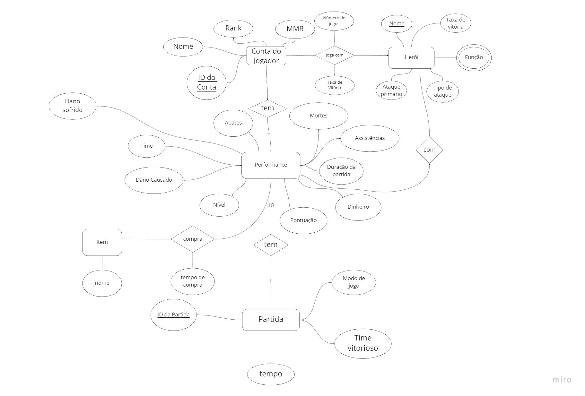

# Dota2Analysis

# Equipe `Dota2Analysis` - `D2A`
* `Hugo Carvalho de Almeida Navarro` - `198893`
* `Matheus Augusto da Silva Cândido` - `241640`
* `Felipe Pacheco Manoel` - `215347`

## Resumo do Projeto

### Tema, motivação e contexto gerador

### Modelo conceitual

### Modelos lógicos

 A api que utilizaremos para acessar os dados para a construção do nosso dataset utiliza um modelo hierárquico para estruturar os dados. De maneira a simplificar o acesso a determinadas situações pretendemos utilizar um modelo relacional de forma que simplifique para o usuário analisar as informações de uma maneira mais direta.

### Perguntas de análise a serem respondidas

### Fontes de dados e operações a serem aplicadas

 Utilizaremos a api pública disponível em https://docs.opendota.com/. Pretendemos requisitar alguns dados e trabalhar em cima deles de forma a fornecer ao leitor relações entre os heróis utilizados nas partidas pelos jogadores, assim como suas habilidades. Refinar os dados coletados e apresentar de forma mais direta ao leitor.

## Slides da Apresentação
> Coloque aqui o link para o PDF da apresentação
