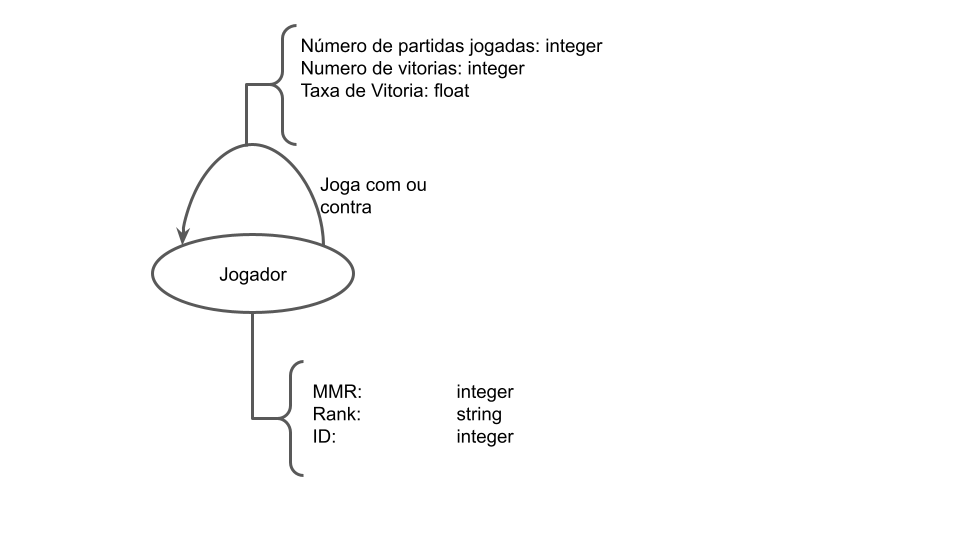

# Modelo para Apresentação da Entrega Final do Projeto

# Projeto `<Dota2Analysis>`

# Equipe - `D2A`
* `Hugo Carvalho de Almeida Navarro` - `198893`
* `Matheus Augusto da Silva Cândido` - `241640`
* `Felipe Pacheco Manoel` - `215473`

## Resumo do Projeto
Criação de um dataset baseado em informações retiradas diretamente do jogo DOTA 2, e posterior análise desse dataset.  
 Com o crescimento constante dos eSports ao redor do mundo, o cenário tende a ser cada vez mais competitivo e disputado. Assim, junto com esses jogos, cresce a necessidade de ferramentas capaz de prover insights aprofundados que fornecam algum tipo de vantagem ao jogador e a equipe. Como objeto de estudo, vimos no DOTA 2 um ambiente rico em informações públicas que podem ser analisadas afim de atingirmos o objetivo citado.

## Slides da Apresentação
[Slides final](slides/final.pdf)

## Modelo Conceitual

  

## Modelos Lógicos

Modelo lógico relacional
~~~
Partidas(_Match_ID_,Average_MMR,Player_1_ID,Player_2_ID,Player_3_ID,Player_4_ID,Player_5_ID,Player_6_ID,Player_7_ID,Player_8_ID,Player_9_ID,Player_10_ID,Radiant_Win,First_Blood_Time,Duration)
Jogador(_Player ID_,MMR, Rank,Win,Lose)
Performance(_Match_ID_,_Player_ID_,Radiant_Team,Level,Hero_ID,Hero_Damage,Hero_Healing,Damage_Taken,Tower_Damage,Kills,Assists,Deaths,KDA,Gold_Per_Minute,Gold_Spent,Experience_Per_Minute,Last_Hits,Item_0,Item_1,Item_2,Item_3,Item_4,Win)
  Ocupante chave estrangeira -> Partida(Match_ID), Performance(Player_ID)
~~~

Modelo Lógico de Grafos

## Dataset Publicado

título | link | breve descrição
----- | ----- | -----
`<match_data.csv>` | `<./data/processed/match_data.csv>` | `<O arquivo contém uma série de informações referentes à partidas públicas>`
`<performance_data.csv>` | `<./data/processed/performance_data.csv>` | `<O arquivo contém uma série de informações referentes a performance de jogadores de partidas já visitadas>`
`<hero_data_winrate.csv>` | `<./data/processed/hero_data_winrate.csv>` | `<O arquivo contém uma série de informações referentes à taxa de vitória de cada herói>`
`<player_data_winrate.csv>` | `<./data/processed/player_data_winrate.csv>` | `<O arquivo contém uma série de informações referentes a taxa de vitórias de um dado jogador>`
`<hero_role_data.csv>` | `<./data/processed/hero_role_data.csv>` | `<O arquivo contém uma série de informações referentes a heróis e sua função>`
`<graph_data.csv>` | `<./data/interim/graph_data.csv>` | `<O arquivo contém informações referentes a duplas de jogadores que se encontram em uma dada partida>`
`<hero_data.csv>` | `<./data/interim/hero_data.csv>` | `<O arquivo contém uma série de informações referentes a heróis>`
`<player_data.csv>` | `<./data/interim/player_data.csv>` | `<O arquivo contém uma série de informações referentes a jogadores de partidas já visitadas>`

## Bases de Dados

título da base | link | breve descrição
----- | ----- | -----
`<OpenDota API>` | `<https://docs.opendota.com/>` | `<API pública consumida através do método GET para diversos filtros>`

## Detalhamento do Projeto
A contrução do dataset é feita a partir do consumo da API OpenDota API a partir do método GET, como descrito a seguir:

~~~python
api_response = requests.get('https://api.opendota.com/api/publicmatches?api_key=YOUR-API-KEY')

if api_response.status_code != 200:
    print("API Request Error - Public Matches not found")

    return 0
else:
    public_matches = api_response.json()
~~~

A resposta da API é transformada em uma estrutura de dados de mapa, formato json nesse caso, e lida para alimentação do respectivo csv linkado ao script.  
O script match_data_request.py irá criar nossa base de dados central onde, para cada partida visitada, os ids dos jogadores será explorado no API, assim como suas performances, criando assim novos datasets.  
~~~python
api_player_info = requests.get('https://api.opendota.com/api/players/' + Player_ID + '?api_key=549DB7F6A3D0BD71854A393A1334C7AC')
~~~
Link para arquivos src:  
`<https://github.com/FelipePM01/Dota2Analysis/tree/src_update/final/src>`  
`<./src>`  

* tratamento de dados recebidos por GET/
* agregação de dados fragmentados obtidos a partir de diferentes chamadas à API
* integração de dados de vários datasets para criação de queries
* transformação de dados para facilitar análise e pesquisa

## Evolução do Projeto
Os modelos logicos e conceituais se mativerem durante o projeto com exceção da inclusão de alguns campos no modelo conceitual e no modelo lógico relacional que consideramos relevantes e a remoção de outros os quais não tinhamos tal informação disponível. O modelo lógico de grafos teve uma versão inicial que só incluia o nó jogador que era o principal , posteriormente tentamos incluir nós para os heróis e para as partidas , mas por concluir que eles não agregavam valor para o projeto optamos por retornar a versão inicial.

## Perguntas de Pesquisa/Análise Combinadas e Respectivas Análises

### Perguntas/Análise com Resposta Implementada

#### Pergunta/Análise 1
* Pergunta 1
 
* Como se organizam as pessoas em grupos de amigos dentro do DOTA 2?
* Será utilizada as arestas com peso entre jogadores para tentar achar grupos em que as arestas ponderadas são mais densas entre si quando comparadas aos demais jogadores. A pergunta se encaixa na modalidade de comunidade/modularidade.
* Para responder essa pergunta foi utilizada a seguinte query:
~~~cypher
LOAD CSV WITH HEADERS FROM 'https://raw.githubusercontent.com/FelipePM01/Dota2Analysis/main/final/data/processed/player_data_winrate.csv' AS line
CREATE (:Jogador {id:line.PLAYER_ID,rank:line.RANK,mmr:line.MMR});
LOAD CSV WITH HEADERS FROM 'https://raw.githubusercontent.com/FelipePM01/Dota2Analysis/main/final/data/processed/new_graph_data.csv' AS line
MATCH (j1:Jogador{id:line.PLAYER_1_ID})
MATCH (j2:Jogador{id:line.PLAYER_2_ID})
CREATE (j1)-[:jogou_com{vezes:line.VEZES}]->(j2)
CALL gds.graph.create.cypher(
  'myGraph',
  'MATCH (n:Jogador) RETURN id(n) AS id,labels(n) As labels',
  'MATCH (n)-[r:jogou_com]->(m) RETURN id(n) AS source, id(m) AS target, type(r) AS type, r.vezes AS vezes'
)
CALL gds.louvain.stream('myGraph', { relationshipWeightProperty: 'vezes' })
YIELD nodeId, communityId, intermediateCommunityIds
RETURN gds.util.asNode(nodeId).id AS id, communityId
ORDER BY communityId ASC
~~~
* Após essa query foi possível observar que cada nó forma a própria comunidade e não ocorreu a formação de grupos de amigos.

#### Pergunta/Análise 2
* Pergunta 2
   
* Existem grupos que tendem a se encontrar mais nas filas ranqueadas? Esses grupos correspondem a pessoas com ranking e MMR similares?
* Será utilizada as arestas entre jogadores para tentar achar grupos em que as arestas são mais densas entre si comparadas aos demais jogadores, em seguida iremos checar as comunidades encontradas para ver se o MMR e o rank são similares. A pergunta se encaixa na modalidade de comunidade/modularidade.
* Para responder essa pergunta foi utilizada a seguinte query:
~~~cypher
LOAD CSV WITH HEADERS FROM 'https://raw.githubusercontent.com/FelipePM01/Dota2Analysis/main/final/data/processed/player_data_winrate.csv' AS line
CREATE (:Jogador {id:line.PLAYER_ID,rank:line.RANK,mmr:line.MMR});
LOAD CSV WITH HEADERS FROM 'https://raw.githubusercontent.com/FelipePM01/Dota2Analysis/main/final/data/processed/new_graph_data.csv' AS line
MATCH (j1:Jogador{id:line.PLAYER_1_ID})
MATCH (j2:Jogador{id:line.PLAYER_2_ID})
CREATE (j1)-[:jogou_com{vezes:line.VEZES}]->(j2)
CALL gds.graph.create.cypher(
  'myGraph',
  'MATCH (n:Jogador) RETURN id(n) AS id,labels(n) As labels',
  'MATCH (n)-[r:jogou_com]->(m) RETURN id(n) AS source, id(m) AS target, type(r) AS type, r.vezes AS vezes'
)
CALL gds.louvain.stream('myGraph')
YIELD nodeId, communityId, intermediateCommunityIds
RETURN gds.util.asNode(nodeId).id AS id, communityId,gds.util.asNode(nodeId).mmr AS mmr
ORDER BY communityId ASC
~~~
* Após a realização dessa query foi possível observar que embora haja uma certa semelhança nas faixas de valores dentro das comunidades , ainda assim ocorreu uma variação significativa dentro das comunidades.
#### Pergunta/Análise 3
* Pergunta 3
   
* Existem jogadores que se destacam em relação à centralidade? Caso existam, o que os diferenciam?
* Utilizando o algoritmo de Pagerank, vamos tentar encontrar os principais jogadores e em seguida comparar seus atributos com a média para entender o que os torna especiais. A pergunta se encaixa na modalidade de centralidade

** Para responder essa pergunta foi utilizada a seguinte query:
~~~cypher
LOAD CSV WITH HEADERS FROM 'https://raw.githubusercontent.com/FelipePM01/Dota2Analysis/main/final/data/processed/player_data_winrate.csv' AS line
CREATE (:Jogador {id:line.PLAYER_ID,rank:line.RANK,mmr:line.MMR});
LOAD CSV WITH HEADERS FROM 'https://raw.githubusercontent.com/FelipePM01/Dota2Analysis/main/final/data/processed/new_graph_data.csv' AS line
MATCH (j1:Jogador{id:line.PLAYER_1_ID})
MATCH (j2:Jogador{id:line.PLAYER_2_ID})
CREATE (j1)-[:jogou_com{vezes:line.VEZES}]->(j2)
CALL gds.graph.create.cypher(
  'myGraph',
  'MATCH (n:Jogador) RETURN id(n) AS id,labels(n) As labels',
  'MATCH (n)-[r:jogou_com]->(m) RETURN id(n) AS source, id(m) AS target, type(r) AS type, r.vezes AS vezes'
)
CALL gds.pageRank.stream('myGraph', {
  maxIterations: 20,
  dampingFactor: 0.85
})
YIELD nodeId, score
RETURN gds.util.asNode(nodeId).id AS id, score
ORDER BY score DESC, id ASC
~~~
* Após analisar o resultado da query , podemos perceber que a presença de centralidade , no entanto isso aconteceu devido a jogadores com mais de uma partida registrada enquanto a maioria tinha apenas uma partida.

### Perguntas/Análise Propostas mas Não Implementadas

#### Pergunta/Análise 1
* Pergunta 1
  
* Qual herói de uma certa função tem a maior winrate?

#### Pergunta/Análise 2
* Pergunta 2
   
* Qual item tem a maior winrate dado um determinado herói?

#### Pergunta/Análise 3
* Pergunta 3
  
* Qual a taxa de jogadores que saem das partidas antes de seu término?

#### Pergunta/Análise 4
* Pergunta 4
  
* Qual é o herói mais popular no geral? E em um rank específico?

#### Pergunta/Análise 5
* Pergunta 5
  
* Como se comporta a winrate de jogadores conforme o ouro ou experiencia por minuto  aumenta? Esse comportamento muda dependendo do rank?
