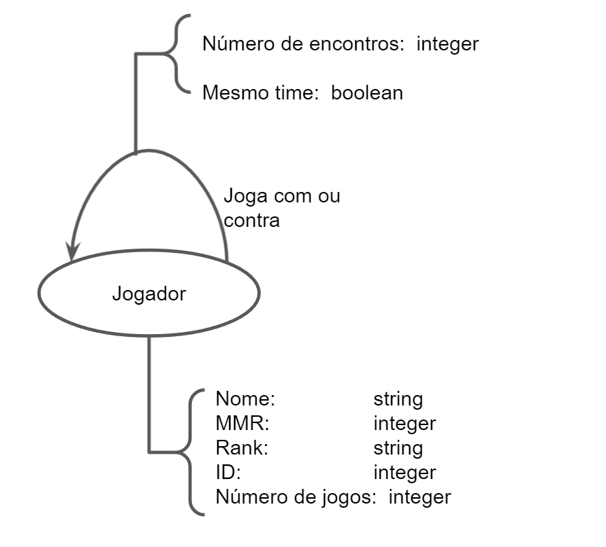

# Apresentação do Lab08 - Modelo Lógico e Análise de Dados em Grafos

# Equipe `Dota2Analysis` - `D2A`
* `Hugo Carvalho de Almeida Navarro` - `198893`
* `Matheus Augusto da Silva Cândido` - `241640`
* `Felipe Pacheco Manoel` - `215347`

## Modelo Lógico Combinado do Banco de Dados de Grafos
>
>
> 

## Perguntas de Pesquisa/Análise Combinadas e Respectivas Análises

### Pergunta/Análise 1
> * Pergunta 1: Como se organizam as pessoas em grupos de amigos dentro do DOTA 2?  
>   
>   * Será utilizada as arestas com peso entre jogadores para tentar achar grupos em que as arestas ponderadas são mais densas entre si quando comparadas aos demais jogadores. A pergunta se encaixa na modalidade de comunidade/modularidade.

### Pergunta/Análise 2
> * Pergunta 2: Existem grupos que tendem a se encontrar mais nas filas ranqueadas? Esses grupos correspondem a pessoas com ranking e MMR similares?
>   
>   * Será utilizada as arestas entre jogadores para tentar achar grupos em que as arestar são mais densas entre si comparadas aos demais jogadores, em seguida iremos checar as comunidades encontradas para ver se o MMR e o rank são similares. A pergunta se encaixa na modalidade de comunidade/modularidade.

### Pergunta/Análise 3
> * Pergunta 3: Existem jogadores que se destacam em relação à centralidade? Caso existam, o que os diferenciam?
>   
>   * Utilizando o algoritmo de Page Rank, vamos tentar encontrar os principais jogadores e em seguida comparar seus atributos com a media para entender o que os torna especiais. A pergunta se encaixa na modalidade de centralidade
