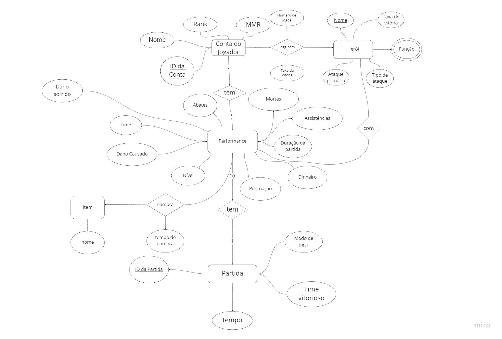

**Projeto Parcial entregue na data 10/01/2021 e movido para esta pasta na data 15/10/2021**
# Dota2Analysis

# Equipe `Dota2Analysis` - `D2A`
* `Hugo Carvalho de Almeida Navarro` - `198893`
* `Matheus Augusto da Silva Cândido` - `241640`
* `Felipe Pacheco Manoel` - `215347`

## Resumo do Projeto

### Tema, motivação e contexto gerador
 Criação de um dataset baseado em informações retiradas diretamente do jogo DOTA 2, e posterior análise desse dataset.  
 Com o crescimento constante dos eSports ao redor do mundo, o cenário tende a ser cada vez mais competitivo e disputado. Assim, junto com esses jogos, cresce a necessidade de ferramentas capaz de prover insights aprofundados que fornecam algum tipo de vantagem ao jogador e a equipe. Como objeto de estudo, vimos no DOTA 2 um ambiente rico em informações públicas que podem ser analisadas afim de atingirmos o objetivo citado.
 
### Modelo conceitual

### Modelos lógicos

 A api que utilizaremos para acessar os dados para a construção do nosso dataset utiliza um modelo hierárquico para estruturar os dados. De maneira a simplificar o acesso a determinadas situações pretendemos utilizar um modelo relacional de forma que simplifique para o usuário analisar as informações de uma maneira mais direta.

### Perguntas de análise a serem respondidas
A partir dos modelos citados , será possível analisar como diversos fatores afetam a taxa de vitória e o desempenho geral dos jogadores , permitindo perceber quais heróis tem vantagem em relação aos outros, quais funcionam bem juntos, quais são as melhores combinações de itens. Além dessas análises gerais , será possível analisar como esses mesmos fatores afetam um jogador em específico. Também poderemos comparar se essas condições sofrem alterações dependendo de outras condições da partida como modo de jogo escolhido.
### Fontes de dados e operações a serem aplicadas

 Utilizaremos a api pública disponível em https://docs.opendota.com/. Pretendemos requisitar alguns dados e trabalhar em cima deles de forma a fornecer ao leitor relações entre os heróis utilizados nas partidas pelos jogadores, assim como suas habilidades. Refinar os dados coletados e apresentar de forma mais direta ao leitor.

## Slides da Apresentação
 [PDF](https://docs.google.com/presentation/d/1AMuYdvCCHGHGg7qLdhIqGdSa24bUhVHd5tgz8DVj9io/edit#slide=id.p)
