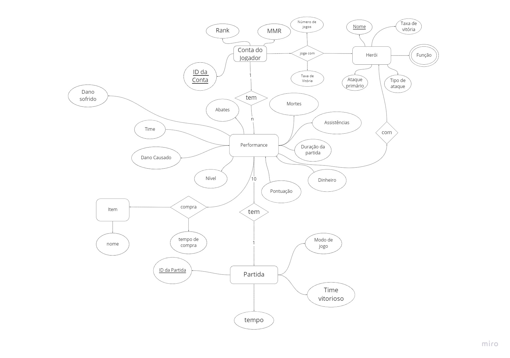
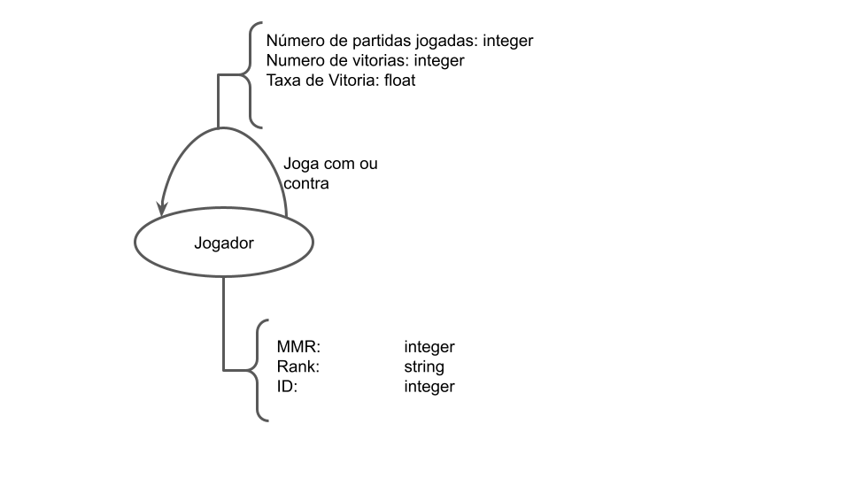

# Apresentação da Entrega Prévia

# Projeto `Dota2Analysis`

# Equipe `Dota2Anlaysis` - `D2A`
* `Hugo Carvalho de Almeida Navarro` - `198893`
* `Matheus Augusto da Silva Cândido` - `241640`
* `Felipe Pacheco Manoel` - `215347`

## Resumo do Projeto
> Criação de um dataset baseado em informações retiradas diretamente do jogo DOTA 2, e posterior análise desse dataset.  
 Com o crescimento constante dos eSports ao redor do mundo, o cenário tende a ser cada vez mais competitivo e disputado. Assim, junto com esses jogos, cresce a necessidade de ferramentas capaz de prover insights aprofundados que fornecam algum tipo de vantagem ao jogador e a equipe. Como objeto de estudo, vimos no DOTA 2 um ambiente rico em informações públicas que podem ser analisadas afim de atingirmos o objetivo citado.

## Slides da Apresentação
> [Slides previa](slides/previa.pdf)

## Modelo Conceitual Preliminar

> 

## Modelos Lógicos Preliminares

> Modelo Logico Relacional
~~~
Partidas(_ID_,Average MMR, Player 1 ID,...,Player 2 ID,Radiant Win,First Blood time, Duration)
  Player ID -> Chave estrangeira

Jogador(_Player ID_,MMR, Rank)
~~~

>Modelo Logico de Grafo
> 

## Dataset Preliminar a ser Publicado

título do arquivo/base | link | breve descrição
----- | ----- | -----
`match_data` | `(data/processed/match_data.csv)` | `Arquivo csv com as partidas que compõe o data set`
`player_data` | `(data/processed/player_data.csv)`| `Arquivo csv com os jogadores que compõe o data set`

## Bases de Dados

título da base | link | breve descrição
----- | ----- | -----
`OpenDota API` | `https://docs.opendota.com/` | `API que apresenta diferetes requests para obter informções do jogo Dota`

## Operações realizadas para a construção do dataset

> [Match](src/match_data_request.py)
>
> [Player](src/player_data_request.py)

## Perguntas de Pesquisa/Análise Combinadas e Respectivas Análises

### Pergunta/Análise 1
> * Pergunta 1: Como se organizam as pessoas em grupos de amigos dentro do DOTA 2?  
>   
>   * Será utilizada as arestas com peso entre jogadores para tentar achar grupos em que as arestas ponderadas são mais densas entre si quando comparadas aos demais jogadores. A pergunta se encaixa na modalidade de comunidade/modularidade.

### Pergunta/Análise 2
> * Pergunta 2: Existem grupos que tendem a se encontrar mais nas filas ranqueadas? Esses grupos correspondem a pessoas com ranking e MMR similares?
>   
>   * Será utilizada as arestas entre jogadores para tentar achar grupos em que as arestar são mais densas entre si comparadas aos demais jogadores, em seguida iremos checar as comunidades encontradas para ver se o MMR e o rank são similares. A pergunta se encaixa na modalidade de comunidade/modularidade.

### Pergunta/Análise 3
> * Pergunta 3: Existem jogadores que se destacam em relação à centralidade? Caso existam, o que os diferenciam?
>   
>   * Utilizando o algoritmo de Page Rank, vamos tentar encontrar os principais jogadores e em seguida comparar seus atributos com a media para entender o que os torna especiais. A pergunta se encaixa na modalidade de centralidade.

>
>
> [Querie Grafo](src/cypher.md)